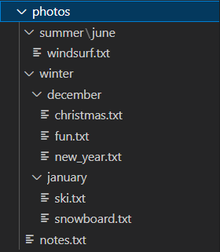

# directory-tree-scheme

Creates a text scheme representing the directory tree. This package is an improvement of [directory-tree by @mihneadb](https://www.npmjs.com/package/directory-tree).

## Install

```bash
$ npm install directory-tree-scheme
```

## Usage

For example, we have a directory called photos that looks like this:
<br>


```ts
import { build_scheme } from "directory-tree-scheme";

const tree = build_scheme("/path-to/photos-directory");
console.log(tree);
```

Running the code above will console log the following plain text tree:
```
├── notes.txt
├── summer
│   └── june
│       └── windsurf.txt
└── winter
    ├── december
    │   ├── christmas.txt
    │   ├── fun.txt
    │   └── new_year.txt
    └── january
        ├── ski.txt
        └── snowboard.txt
```

You can also get the tree as a JS object:
```ts
import { build_tree } from "directory-tree-scheme";

const tree = build_tree("/path-to/photos-directory");
console.log(tree);
```

Running the code above will console log the following plain text tree:
```
{
  path: '/photos',
  name: 'photos',
  children: [
    {
      path: '/photos/notes.txt',
      name: 'notes.txt'
    },
    {
      path: '/photos/summer',
      name: 'summer',
      children: [Array]
    },
    {
      path: '/photos/winter',
      name: 'winter',
      children: [Array]
    }
  ]
}
```
### Other
Full documentation can be found [here](https://www.npmjs.com/package/directory-tree)